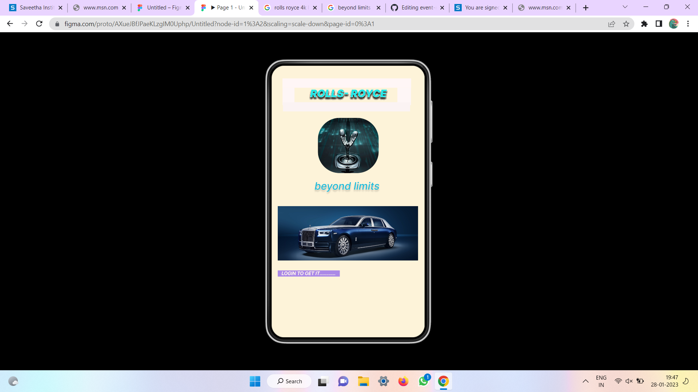
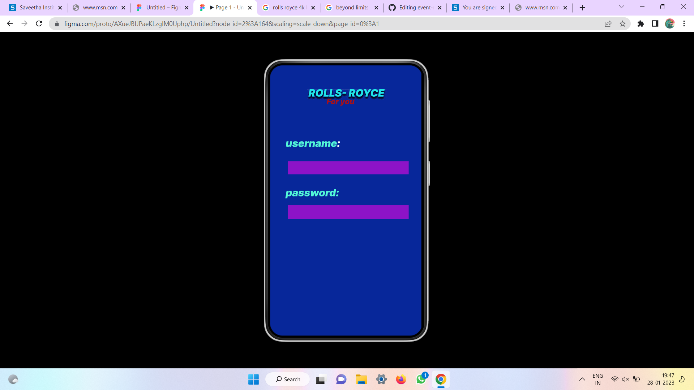
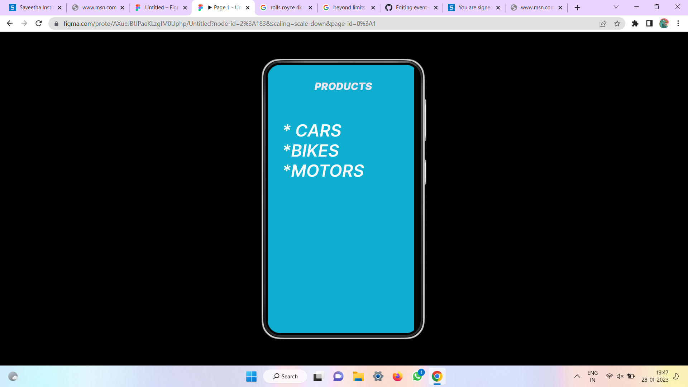

# Event Registration Web Application

## AIM:

To design, develop and deploy a web application for event registration.

## DESIGN STEPS:

### Step 1:

Create a new frame.

### Step 2:

Select any one preset size of your choice.

### Step 3:

Select the shapes you need.

### Step 4:

Import images as needed.

### Step 5:

Create pages based on your need and link them.

### Step 6:

Validate the HTML and CSS code.

### Step 7:

Publish the website in the given URL.

## DESIGN TOOL:
FIGMA

## PROGRAM :
```
/* Home Page */
position: relative;
width: 369px;
height: 640px;
background: #F40606;

/* Login Page */
position: relative;
width: 360px;
height: 640px;
background: #DCFF09;

/* Saveetha Engineering college */
position: absolute;
width: 334px;
height: 62px;
left: 13px;
top: 0px;
font-family: 'Inter';
font-style: normal;
font-weight: 400;
font-size: 20px;
line-height: 24px;
display: flex;
align-items: center;
text-align: center;
color: #3F12F3;

/* DEPARTMENTS */
position: absolute;
width: 334px;
height: 34px;
left: 13px;
top: 232px;
font-family: 'Inter';
font-style: normal;
font-weight: 400;
font-size: 20px;
line-height: 24px;
display: flex;
align-items: center;
text-align: center;
color: #3F12F3;

/* AI-ML */
position: absolute;
width: 334px;
height: 34px;
left: 13px;
top: 303px;
font-family: 'Inter';
font-style: normal;
font-weight: 400;
font-size: 20px;
line-height: 24px;
display: flex;
align-items: center;
text-align: center;
color: #3F12F3;

/* AI-DS */
position: absolute;
width: 334px;
height: 34px;
left: 13px;
top: 374px;
font-family: 'Inter';
font-style: normal;
font-weight: 400;
font-size: 20px;
line-height: 24px;
display: flex;
align-items: center;
text-align: center;
color: #3F12F3;

/* IOT */
position: absolute;
width: 334px;
height: 34px;
left: 13px;
top: 442px;
font-family: 'Inter';
font-style: normal;
font-weight: 400;
font-size: 20px;
line-height: 24px;
display: flex;
align-items: center;
text-align: center;
color: #3F12F3;

/* CSE */
position: absolute;
width: 334px;
height: 34px;
left: 13px;
top: 498px;
font-family: 'Inter';
font-style: normal;
font-weight: 400;
font-size: 20px;
line-height: 24px;
display: flex;
align-items: center;
text-align: center;
color: #3F12F3;

/* Line 3 */
position: absolute;
width: 360.01px;
height: 0px;
left: 360px;
top: 72px
border: 4px solid #1229FD;
transform: rotate(179.68deg);

/* sav-removebg-preview 3 */
position: absolute;
width: 114px;
height: 114px;
left: 123px;
top: 96px;
background: url(sav-removebg-preview.png);
```


## OUTPUT:









## Result:
The program to design, develop and deploy a web application for event registration is completed successfully.

